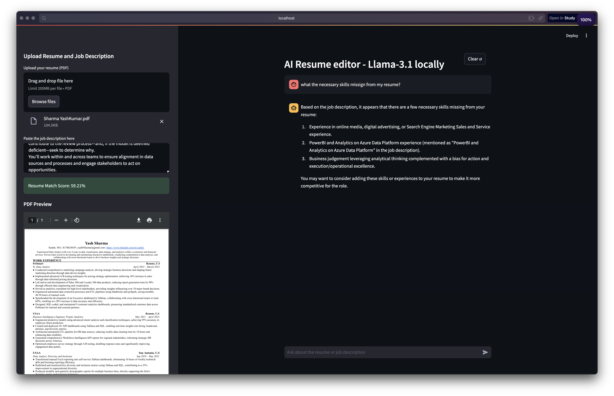

# AI Resume Editor

#### using LLAMA 3.1 locally

This Streamlit app provides an AI-powered resume analysis and editing tool using Llama 3.1 locally. Key features include:

- Upload resume (PDF) and paste job description
- Calculate resume-job description similarity score
- AI-powered chat interface to ask questions about the resume, job description
- Uses LlamaIndex for document indexing and querying
- Employs Ollama for local LLM inference
- Utilizes HuggingFace embeddings for improved semantic understanding

The app allows users to get instant feedback on their resume's match to a job description and provides an interactive way to explore and improve their application materials

